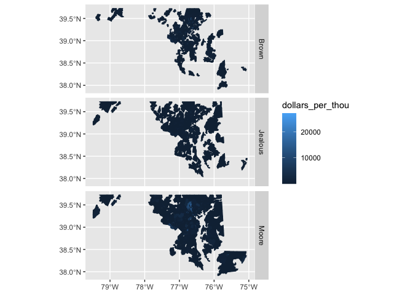
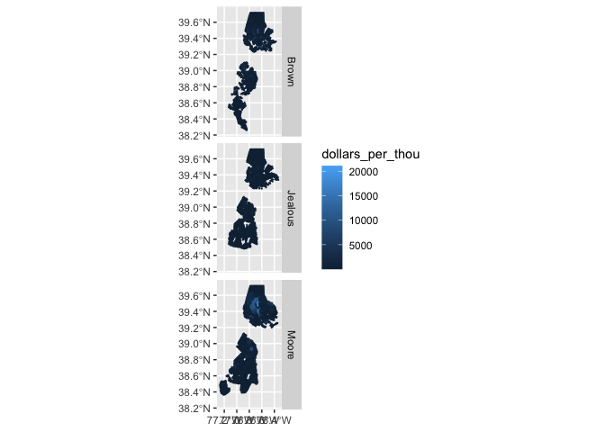
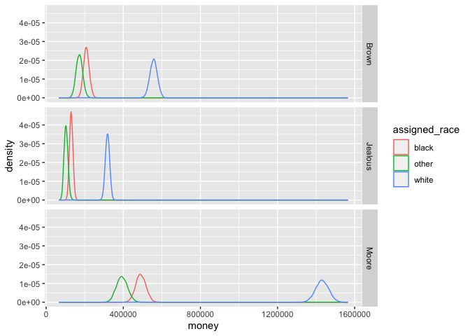
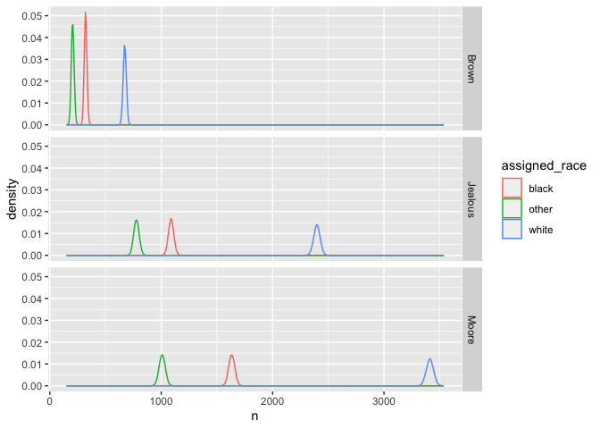

Moore Campaign Donations
================
Nick Thieme
2022-11-02

### Introduction

This is the code that goes along with the story “In Black professionals,
Wes Moore finds strong support and generous donors”
[here](https://www.thebaltimorebanner.com/article/black-professionals-moore-6ZCLRWPLDRAZZI53NKTXJO5LFM/).

### Library

``` r
library(VGAM)
library(tidyverse)
library(postmastr)
library(pdftools)
library(stringr)
library(tidycensus)
library(sf)
library(data.table)
library(mgcv)
library(rgdal)

source("~/Desktop/banner_projects/real_estate/helper_funs.R")
```

### PDF parsing

The first step in the analysis is parsing the campaign contribution PDF.
Fortunately, the contribution files for the older elections are
available in tabular format, so we only need to do this for Moore.
Initially, I tried using Tabula for this, but the total donation amount
doesn’t come close to matching the listed amount on the PDF, so I wrote
a custom parser for it. You load in the PDF, iterate by page, and take
advantage of the “fixed-width” nature of this kind of report / the fact
that there are regular symbols (specifically the `\` symbol used in the
contribution dates). There are a few other tricks in there, but long
story short, we match the totals almost exactly. I also grey out the
write_csv statements because I don’t need them here.

``` r
D_pdf<-pdftools::pdf_text(pdf = "~/Desktop/banner_projects/moore_donations/moore_gen_2.pdf")
contributions<-D_pdf[3:963]

D_tot<-data.frame()

for(i in 1:length(contributions)){
  most_of_the_page<-contributions[[i]] %>% str_split("\n") %>% {.[[1]]} %>% trimws %>% {.[6:length(.)]}
  
  page_rm<-most_of_the_page %>% str_detect("Current") %>% {which(.)}
  most_of_the_page_2<-most_of_the_page[1:(page_rm-1)]
  space_to_rm<-(most_of_the_page_2=="") %>% {which(.)}
  most_of_the_page_3<-most_of_the_page_2[-space_to_rm]
  to_rm_employ<-most_of_the_page_3 %>% str_detect(c("Not Employed", "Employed")) %>% {which(.)}
  
  
  if(length(to_rm_employ)>0){
    most_of_the_page_4<-most_of_the_page_3[-to_rm_employ]
  }else{
    most_of_the_page_4<-most_of_the_page_3
  }
  
  to_keep_num <- most_of_the_page_4 %>% str_detect("[0-9]") %>% {which(.)}
  
  most_of_the_page_5<-most_of_the_page_4[to_keep_num]
  
  most_of_the_page_6<-most_of_the_page_5 %>% str_split("          ") %>% lapply(
    function(x){
      return(x[1])
    }
  )
  
  money<-most_of_the_page_5 %>% str_split("          ") %>% lapply(
    function(x){
      to_rm<-which(x=="")
      x_2<-x[-to_rm]
      x_3<-x_2[3] %>% trimws
      return(x_3)
      
    }
  ) %>% unlist %>% na.omit
  
  slash_inds<-lapply(most_of_the_page_6, 
         function(x){
           contains_state<-str_locate_all(x, "\\/") %>% unlist %>% {length(.)>=4}
         }) %>% 
    unlist %>% 
    {which(.)}

  names <- rep(0, length(slash_inds))
  addrs <- rep(0, length(slash_inds))
    
  for(j in 1:(length(slash_inds)-1)){
      this_sec<- most_of_the_page_6[slash_inds[j]:(slash_inds[j+1]-1)]
      addrs[j]<-this_sec[-1] %>% str_c(collapse = " ")
      names[j]<-this_sec[1]
  }
  
  this_sec<-most_of_the_page_6[slash_inds[length(slash_inds)]:length(most_of_the_page_6)]
  addrs[length(slash_inds)]<-this_sec[-1] %>% str_c(collapse = " ")
  names[length(slash_inds)]<-this_sec[1] %>% unlist

  dates = names %>% str_split(" ") %>% lapply(function(x)return(x[1])) %>% unlist
  names<-tibble(names, dates) %>% mutate(names = str_remove(names, dates) %>% trimws) %>% pull(names)
  
  D_curr_page<-tibble(dates, names, addrs, money)
  D_tot<-rbind(D_tot, D_curr_page)
}

D_tot_f<-D_tot %>% mutate(money = str_remove(money,"\\$") %>%str_remove(",") %>% as.numeric)
#write_csv(D_tot_f, "~/Desktop/banner_projects/moore_donations/MooreContributionsList_2.csv")

### address parsing and geocoding
#at this point, we have our data and we put them together for geocoding
D_jealous <- read_csv("~/Desktop/banner_projects/moore_donations/JealousContributionsList.csv") %>% 
  filter(`Filing Period` == "2018 Gubernatorial Pre-General2 Report") %>% add_column(candidate = "Jealous") %>% 
  select(dates = "Contribution Date", names = "Contributor Name", addrs = "Contributor Address", money = "Contribution Amount", candidate) %>% 
  filter(money<6001)

D_brown<- read_csv("~/Desktop/banner_projects/moore_donations/BrownContributionsList_2.csv")%>% 
  filter(`Filing Period` == "2014 Gubernatorial Pre-General2 Report")%>% add_column(candidate = "Brown")%>% 
  select(dates = "Contribution Date", names = "Contributor Name", addrs = "Contributor Address", money = "Contribution Amount", candidate)%>% 
  filter(money<6001)

D_moore<-read_csv("~/Desktop/banner_projects/moore_donations/MooreContributionsList_2.csv")%>% add_column(candidate = "Moore")

D_donations <- rbind(D_jealous, D_brown,D_moore)
```

### Address parsing

I’ve also recently discovered an absolutely amazing R package called
postmastr that regularizes addresses for geocoding / joining. I’ve never
had a package go from unknown to me to essential as quickly as this.
It’s legitimately a lubridate-level improvement. Using postmastr, we
combine the candidates contribution datasets and regularize their
addresses.

``` r
D_donations_2<-D_donations %>% pm_identify(var = "addrs")
D_donations_3<-D_donations_2%>% pm_prep(var = "addrs", type = "street") 

dirsDict <- pm_dictionary(type = "directional", locale = "us")
stateDict <- pm_dictionary(type = "state", locale = "us")

D_postmast_addr_2_f<-D_donations_3 %>% 
  pm_postal_parse() %>% 
  pm_state_parse(dictionary = stateDict) 

state_num<-D_postmast_addr_2_f$pm.state %>% table %>% sort
state_names_in<-names(state_num)

to_rm<-which(state_names_in%in%c("GU", "VI","AE", "PR", "AP","MH"))
state_names_in_2<-state_names_in[-to_rm]
D_postmast_addr_3<-D_postmast_addr_2_f %>% filter(pm.state%in%c("GU", "VI","AE","PR", "AP","MH")==FALSE)

list_state = vector(mode = "list", length = length(state_num))

for(i in 1:length(state_num)){
  list_state[[i]]<-pm_dictionary(type = "city", locale = "us", filter=state_names_in_2[i])
}


D_tot <- data.frame()

for(i in 1:length(state_names_in_2)){
  D_tmp<-D_postmast_addr_3 %>% filter(pm.state==state_names_in_2[i]) %>% 
    pm_city_parse(dictionary =  list_state[[i]])
  
  D_tot<- rbind(D_tot, D_tmp)
}

suffix_dict_fake<-pm_dictionary(type = "suffix")

suffix_dict_fake_2<-suffix_dict_fake %>%
  filter(suf.output%in%c("Aly","Ave", "Blvd", "Cir","Ct", "Ctr", "Dr","Expy",  "Fwy", "Ln", "Pike", "Pl","Pkwy", "Rd", "Rte", "St", "Ter", "Tpke", "Way")) %>%
  pull(suf.input)

D_tot_missing_city_na<-D_tot %>% filter(is.na(pm.city))

for(i in 1:nrow(D_tot_missing_city_na)){
  address_term<-(D_tot_missing_city_na[i,]$pm.address %>% str_split(" "))[[1]]
  detected<-which(suffix_dict_fake_2%in%address_term)
  detected<-detected[length(detected)]
  
  if(length(detected)==0){
    next
  }
  
  item_detected<-suffix_dict_fake_2[detected]
  item_ind<-which(address_term==item_detected)
  city = address_term[(item_ind+1):length(address_term)] %>% str_c(collapse=" ")
  D_tot_missing_city_na$pm.city[i]<-city
}

D_tot_2<-D_tot_missing_city_na %>% filter(is.na(pm.city)==FALSE) %>%
  mutate(pm.address = str_remove(pm.address,pm.city) %>% trimws,
         pm.city = pm.city %>% str_split("[0-9]") %>% 
           lapply(.,function(x){
             return(x[length(x)])
           }
           ) %>% unlist %>% trimws
         ) %>% rbind(., D_tot %>% filter(is.na(pm.city)==FALSE))%>% 
  pm_house_parse()  


D_tot_missing_city<-D_tot_2 %>% filter(pm.city=="")

D_tot_missing_city_2<-D_tot_missing_city %>% rowwise %>% mutate(has_dc = str_detect(pm.address, "Washington"),
                                                                pm.city = case_when(has_dc == TRUE~"Washington",
                                                                                    has_dc == FALSE~ "not"),
                                                                pm.address = str_remove(pm.address, "Washington") %>% trimws)

D_tot_3<-D_tot_2 %>% filter(pm.city!="") %>% rbind(., D_tot_missing_city_2 %>% select(-has_dc))

D_tot_3_unit<-D_tot_3 %>%  pm_unit_parse() %>% 
  mutate(pm.unit = str_remove_all(pm.unit,"[a-zA-Z]") %>% trimws) %>% 
  select(pm.uid, pm.unit)

D_tot_4<-D_tot_3 %>% pm_streetDir_parse(dictionary = dirsDict) %>%
  pm_streetSuf_parse() %>% left_join(D_tot_3_unit)

D_postmast_addr_3<-D_tot_4 %>% 
  mutate(pm.house = pm.house %>% str_remove(., "^0+") %>% str_remove(., ">"))%>% 
  mutate(pm.house=str_split(pm.house,"-") %>% lapply(function(x)return(x[1])) %>% unlist,
         pm.preDir=replace_na(pm.preDir,""),
         pm.streetSuf=replace_na(pm.streetSuf,""),
         pm.sufDir=replace_na(pm.sufDir,""),
         pm.unit=replace_na(pm.unit,""),
         
         pm.addr.full = str_c(pm.house, " ",pm.preDir, " ",pm.address," ", pm.streetSuf, " ", pm.sufDir,", ", pm.city, ", ", pm.state %>% toupper, " ", pm.zip) %>% 
           trimws %>%  str_replace("  "," ") %>% str_replace("  "," ") %>% str_replace(" , ", ", ") %>% str_remove(", not")) %>%
  select(pm.uid,pm.addr.full)

D_donations_f<-D_donations_2 %>% left_join(D_postmast_addr_3, "pm.uid") %>% 
  select(pm.uid, dates, names, addrs,pm.addr.full, money, candidate) %>% 
  filter(str_detect(pm.addr.full, "MD")|str_detect(pm.addr.full,"Maryland"))

D_donations_not_MD<-D_donations_2 %>% left_join(D_postmast_addr_3, "pm.uid") %>% 
  select(pm.uid, dates, names, addrs,pm.addr.full, money, candidate) %>% 
  filter((str_detect(pm.addr.full, "Maryland")|str_detect(pm.addr.full, "MD"))==FALSE)
```

## Checking match

The regularizing does mean we lose some data points, however. For
example, donations from P.O boxes disappear from the geocoded data. That
results in losing $54k of Brown donations, $9k of Moore donations, and
$4k of Jealous donations. That’s a very small percentage of the total,
but it’s still worth understanding. Brown receives a great deal more
money from P.O. boxes is what drives the difference there. Overall, we
lose about 500 addresses, but only 17 are from MD. This is out of 17k
addresses, which is pretty good. Since donations are capped at $6k, we
can’t be losing *too* much. In terms of total donations, this takes us
from 23,126 to 21,893 (94% coverage) overall and 97% overall in MD.

``` r
Brown_donors_original<-D_donations_2 %>% filter(candidate=="Brown", money<6001, str_detect(addrs,"Maryland")|str_detect(addrs, "MD"))

Brown_donors_original %>% filter(pm.uid%in%D_donations_f$pm.uid==FALSE) %>% pull(money) %>% sum

#(D_donations_f %>% nrow)/(D_donations %>% filter(str_detect(addrs,"MD")|str_detect(addrs, "Maryland")) %>% nrow)

#D_donations_f %>% write_csv("~/Desktop/banner_projects/moore_donations/D_addr_full_to_geo_2.csv")
#rbind(D_donations_f, D_donations_not_MD) %>% write_csv("~/Desktop/banner_projects/moore_donations/full_geo_donations.csv")
```

### Analysis

We geocode the regularized data with Geocod.io and read it back in
before starting the analysis. I won’t repeat what’s in the story, but I
do want to give a general idea of what we’re doing here. We spatially
join the geocoded donation data with Census data to be able to make
statements about the differences in donation from majority Black and
non-majority Black census tracts. There are a lot of interesting things
to say with this analysis, but one limitation is that we can’t say much
about individual people inside those Census tracts. We don’t know who is
donating, and while donations coming from Census tracts with larger
Black populations are, assuming the propensity to donate is equal (which
probably isn’t true, but is a usable assumption, nonetheless), more
likely to have come from Black donors, we’d like a way of adding
probabilities to this.

``` r
D_donations_geo<-read_csv("~/Desktop/banner_projects/moore_donations/full_geo_donations_geocodio_d5eb1cf1dc0418e06c21cd9d848d0c51063b6f0a.csv") %>% 
  filter(money<6001)

#analysis
MD_acs<-get_acs(geography = "tract", state = "MD",
                   variables=c(med_inc="B19013_001",white = "B02001_002", 
                               black = "B02001_003", 
                               poverty = "B17001_002"), geometry = T, summary_var = "B01001_001"
) 

MD_acs_wide<-MD_acs %>% pivot_wider(c(-summary_moe, - moe),names_from= variable, values_from = estimate) %>% st_as_sf

#this is the donation map. very interesting
D_donations_geo_sf<-D_donations_geo %>% filter(Latitude>0,Longitude<0) %>% st_as_sf(coords = c("Longitude", "Latitude"))%>% st_set_crs(st_crs(MD_acs)) %>% 
  select(dates, names, addrs, pm.addr.full,candidate, money, `Accuracy Score`)

D_donations_acs_sf<-MD_acs_wide %>% st_join(D_donations_geo_sf)

D_donations_acs_sf_sum<-D_donations_acs_sf %>% data.frame %>% group_by(NAME, candidate) %>%
  summarise(summary_est=summary_est[1], white = white[1], black = black[1], poverty = poverty[1], med_inc = med_inc[1], money = sum(money), 
            n =n(), geometry = geometry[1]) %>% 
  na.omit %>% ungroup 

D_donations_acs_sf_sum%>% st_as_sf %>% mutate(dollars_per_thou = money/summary_est*1000) %>%
  ggplot(aes(color = dollars_per_thou, fill = dollars_per_thou))+geom_sf()+facet_grid(vars(candidate))
```

<!-- -->

``` r
D_donations_acs_sf_sum_f<-D_donations_acs_sf_sum %>% pivot_wider(names_from = candidate, values_from = c(money, n)) %>% 
  mutate(
    across(
      starts_with(c("money_","n_")),
      function(x)return(replace_na(x, 0))
      ),
    blk_perc = black/summary_est,
    wht_perc = white/summary_est,
    pov_rate = poverty/summary_est
         )

D_temp_don<-D_donations_acs_sf %>% as.data.frame %>% mutate(blk_perc = black / summary_est,wht_perc = white / summary_est, maj_blk = blk_perc>.5) %>% 
  group_by(candidate, maj_blk) %>% 
  summarise(avg_money= mean(money), n= n(), money = sum(money)) %>% na.omit

D_temp_don

D_temp_don%>% 
  pivot_wider(-c(avg_money), names_from = candidate, values_from = c(money, n)) %>% 
  mutate(rat_moore_jeal = n_Moore/n_Jealous, rat_moore_jeal_mon = money_Moore/money_Jealous,
         rat_moore_brown = n_Moore/n_Brown, rat_moore_brown_mon = money_Moore/money_Brown,
         rat_jeal_brown = n_Jealous/n_Brown, rat_jeal_brown_mon = money_Jealous/money_Brown)

D_grouped_most<-D_donations_acs_sf_sum_f %>% rowwise %>% 
  mutate(
    most_money=
    case_when(
      max(c(money_Moore, money_Brown, money_Jealous))==money_Moore~"moore",
      max(c(money_Moore, money_Brown, money_Jealous))==money_Brown~"brown",
      max(c(money_Moore, money_Brown, money_Jealous))==money_Jealous~"jealous"
      ),
    
    most_donations=
      case_when(
        max(c(n_Moore, n_Brown, n_Jealous))==n_Moore~"moore",
        max(c(n_Moore, n_Brown, n_Jealous))==n_Brown~"brown",
        max(c(n_Moore, n_Brown, n_Jealous))==n_Jealous~"jealous"
      ),
    maj_black = blk_perc>.5
  ) 
```

### County-by-county

This is the county by county analysis.

``` r
D_donations_geo_subset<-D_donations_geo %>% filter(County%in%c("Baltimore City", "Baltimore County", "Prince George's County", "Charles County"))

D_donations_geo_sf_subset<-D_donations_geo_subset %>% filter(Latitude>0,Longitude<0) %>% st_as_sf(coords = c("Longitude", "Latitude"))%>% st_set_crs(st_crs(MD_acs)) %>% 
  select(dates, names, addrs, pm.addr.full,candidate, money, `Accuracy Score`)

D_donations_acs_sf_subset<-MD_acs_wide %>% st_join(D_donations_geo_sf_subset)

D_donations_acs_sf_sum_subset<-D_donations_acs_sf_subset %>% data.frame %>% group_by(NAME, candidate) %>%
  summarise(summary_est=summary_est[1], white = white[1], black = black[1], poverty = poverty[1], med_inc = med_inc[1], money = sum(money), 
            n =n(), geometry = geometry[1]) %>% 
  na.omit %>% ungroup 

D_donations_acs_sf_sum_subset%>% st_as_sf %>% mutate(dollars_per_thou = money/summary_est*1000) %>%
  ggplot(aes(color = dollars_per_thou, fill = dollars_per_thou))+geom_sf()+facet_grid(vars(candidate))
```

<!-- -->

``` r
D_donations_acs_sf_sum_f_subset<-D_donations_acs_sf_sum_subset %>% pivot_wider(names_from = candidate, values_from = c(money, n)) %>% 
  mutate(
    across(
      starts_with(c("money_","n_")),
      function(x)return(replace_na(x, 0))
    ),
    blk_perc = black/summary_est,
    wht_perc = white/summary_est,
    pov_rate = poverty/summary_est,
    county = str_split(NAME, ",") %>% lapply(
      function(x){
        return(x[2] %>% trimws)
      }
      ) %>% unlist
  )

D_donations_acs_sf_subset%>% as.data.frame %>% mutate(blk_perc = black / summary_est,wht_perc = white / summary_est, maj_blk = blk_perc>.5,
                                                      county = str_split(NAME, ",") %>% lapply(
                                                        function(x){
                                                          return(x[2] %>% trimws)
                                                        }
                                                      ) %>% unlist) %>% 
  group_by(candidate, maj_blk, county) %>% 
  summarise(avg_money= mean(money), n= n(), money = sum(money)) %>% na.omit %>% 
  arrange(county, maj_blk) %>% pivot_wider(names_from = candidate, values_from = c(avg_money, n, money)) %>% 
  mutate(rat_moore_jeal = n_Moore/n_Jealous, rat_moore_jeal_mon = money_Moore/money_Jealous,
         rat_moore_brown = n_Moore/n_Brown, rat_moore_brown_mon = money_Moore/money_Brown,
         rat_jeal_brown = n_Jealous/n_Brown, rat_jeal_brown_mon = money_Jealous/money_Brown) 
```

    ## # A tibble: 8 × 17
    ## # Groups:   maj_blk [2]
    ##   maj_blk county avg_m…¹ avg_m…² avg_m…³ n_Brown n_Jea…⁴ n_Moore money…⁵ money…⁶
    ##   <lgl>   <chr>    <dbl>   <dbl>   <dbl>   <int>   <int>   <int>   <dbl>   <dbl>
    ## 1 FALSE   Balti…    839.   134.     621.     138     605     628 115801   81365.
    ## 2 TRUE    Balti…    536.   104.     221.      46     216     273  24675   22495 
    ## 3 FALSE   Balti…   1105.    93.3    796.     228     431     840 251918.  40214.
    ## 4 TRUE    Balti…    888.   156.     323.      19      61     196  16877.   9520 
    ## 5 FALSE   Charl…    294.    26.6    120.      10      16      31   2935     425 
    ## 6 TRUE    Charl…     59     45.7    170.       5      22      41    295    1005 
    ## 7 FALSE   Princ…    866.    88.8    122.      47     315     213  40719   27985.
    ## 8 TRUE    Princ…    580.   124.     273.     180     347     837 104355   43042.
    ## # … with 7 more variables: money_Moore <dbl>, rat_moore_jeal <dbl>,
    ## #   rat_moore_jeal_mon <dbl>, rat_moore_brown <dbl>, rat_moore_brown_mon <dbl>,
    ## #   rat_jeal_brown <dbl>, rat_jeal_brown_mon <dbl>, and abbreviated variable
    ## #   names ¹​avg_money_Brown, ²​avg_money_Jealous, ³​avg_money_Moore, ⁴​n_Jealous,
    ## #   ⁵​money_Brown, ⁶​money_Jealous
    ## # ℹ Use `colnames()` to see all variable names

### Simulation

One way of estimating how much money came from Black donors is a sort of
linear interpolation / Binomial method. Treat the probability of a
donation having come from a Black donor as the percentage of residents
in a Census tract that are Black. Assign that portion of the total
donation amount in a Census tract to Black donors, and sum. We tried
this and it works, but we had a better idea, so we used that instead. We
present that here.

We perform a “simulation” of donations off the same logic and repeat the
simulation many times, averaging the results at the end.

First, we create 10,000 copies of our donation dataset. Each row of each
dataset is a donation, and that row also includes the percentage of
white and black residents in the tract. Following general simulation
logic, we generate one random uniform(0,1) sample per row per dataset
copy. We compare the U(0,1) to the percentage of Black residents in that
row. If U(0,1) \< Black %, we assign that row to Black. If it’s between
Black% and Black% + white%, we assign it to white. We need to add the
two to give White% enough density. If U(0,1) \> Black% + White%, we
assign it to other. Then we add together the totals per copy and average
the results across all copies.

``` r
set.seed(30)
n_reps <- 10000

D_donations_mcmc<-D_donations_acs_sf %>% data.frame %>% mutate(blk_perc= black/summary_est, white_perc = white/summary_est,
                                                               county = str_split(NAME, ",") %>% lapply(
                                                                 function(x){
                                                                   return(x[2] %>% trimws)
                                                                 }
                                                               ) %>% unlist) %>% filter(county!="Baltimore County") %>% data.table

#create the holder vector
D_list_samps<-vector(mode = "list", length = n_reps)

for(i in 1:length(D_list_samps)){
  D_list_samps[[i]]<-D_donations_mcmc %>% add_column(assigned_race = "") %>% add_column(itr = i)
}

#I think this code takes care of the iteration. But I'm going to write through it just to make sure. 

#we have a list of identical copies of the donation dataset. each row is a donation, and that row includes the percentage of white and black 
#residents in the tract. 

#we use lapply to apply the same function to each identical copy because this is leagues faster than a for loop. Our function generates one random
#uniform(0,1) sample per row per copy. We compare the U(0,1) to the percentage black in its row. following simulation-style logic, if 
#U(0,1) < black % we assign that row to black, if it's between black % and black % + white % (we need to add them to give white % the correct 
#density) we assign it to white, if it's greater than white we give it to other.

#this creates one thousand simulations of how donations could be assigned based on an equal probability of donation. this assumption is obviously 
#violated, but this gives us more to work with than just calculating a binomial mean (though the mean will match asymptotically)

  D_new<-lapply(D_list_samps, function(x){
    blk_perc_r<-runif(nrow(x))
    
    assign_blk<-which(blk_perc_r<x$blk_perc)
    assign_wht<-which(blk_perc_r>x$blk_perc&(blk_perc_r<(x$blk_perc+x$white_perc)))
    assign_other<-which(blk_perc_r>(x$blk_perc+x$white_perc))
    
    x[assign_blk, "assigned_race":="black"]
    x[assign_wht, "assigned_race":="white"]
    x[assign_other, "assigned_race":="other"]
    
    return(x)
  }
  )

##now, we get results out
  
  D_new_agg<-lapply(D_new, function(x){
    x_new<-x[assigned_race!="",.(money = sum(money), n = .N),by = .(assigned_race, candidate)] %>% na.omit
    return(x_new)
  }
  )
  
  D_new_agg_j<-do.call("rbind", D_new_agg)
  
  #these charts are interesting because they show basically that Moore has slightly higher fundraising among Black MDers than Brown did, but really
  #the big difference is that he just gets a lot more white money than Brown did. 40k v about 63k. The other big difference, as already mentioned
  #is that Moore is getting a lot of donations from everyone. Brown got few donations at high values. Jealous got a medium number of donations for 
  #low values. Moore is getting a lot of donations at medium value.
  D_new_agg_j %>% data.frame %>% ggplot(aes(x = money, color = assigned_race))+geom_density()+facet_grid(vars(candidate))
```

<!-- -->

``` r
  D_new_agg_j %>% data.frame %>% ggplot(aes(x = n, color = assigned_race))+geom_density()+facet_grid(vars(candidate))
```

<!-- -->
